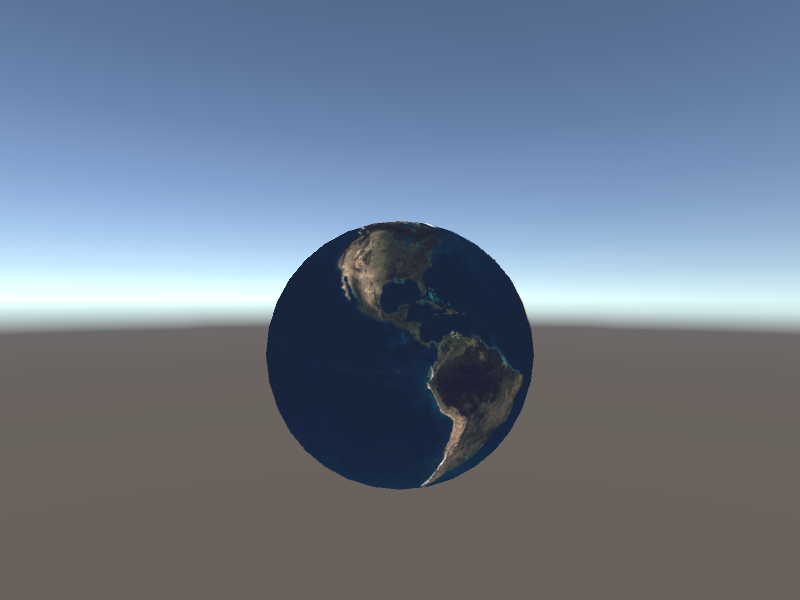

# OnRenderImage から受け取れる src の RenderTexture の Stencil バッファはクリアされている

## 背景

Unity 5.5.2 までは [OnRenderImage](https://docs.unity3d.com/jp/530/ScriptReference/MonoBehaviour.OnRenderImage.html) の引数として受け取れる src の RenderTexture に Stencil 情報が含まれていました。

ところが、Unity 5.6.0f3 以降では仕様が変更されて Stencil バッファがクリアされた RenderTexture しか受け取れなくなってしまいました。
Unity 2017.2.0.p3 でも Stencil はクリアされる仕様のままです。

- ソース: [[Unity 5.6.0f3] empty stencil buffer OnRenderImage](https://forum.unity.com/threads/unity-5-6-0f3-empty-stencil-buffer-onrenderimage.473444/)

この変更により Stencil バッファを用いたポストエフェクトの実装が困難になりました。

リムライト表現用のマスク画像の生成に Stencil バッファを用いる予定でしたが、現在の Unity の仕様だとマスク画像の生成ができませんでした。

そこで、Stencil バッファがクリアされる前の状態の RenderTexture を受け取って、ポストエフェクトの処理に利用するための検証を行いました。

## 検証環境

- Unity 2017.2.0.p3
- macOS Sieera 10.12.6

## OnPostRender による解決方法

OnRenderImage 相当の機能を OnPostRender で置き換えることで、Stencil バッファを参照したマスク画像の生成を実装できました。

検証シーン: [Assets/OnPostRenderTest/](https://github.com/gam0022/image-effect-stencil-test/blob/master/Assets/OnPostRenderTest/)

**図1** はシーンの様子です。

地球のテクスチャがアサインされた Material（シェーダーは `Unlit/WriteStencilTexture`）は Stencil に 1 を書き込みます。



**図1: シーンの描画結果**

シーンを再生した状態で Window メニューから Frame Debugger を起動すると、レンダリング過程の RenderTexture の中身を見れます。

`Hidden/Mask` は Stencil が 1 の箇所だけ実行されるシェーダーです。これが正しく実行されると **図2** の地球のマスク画像を生成できます。


**図2: マスク画像の描画結果**

### 実装の解説

まずは `Start()` 内で `Camera.targetTexture = TargetRenderTexture;` を指定し、
`TargetRenderTexture` に対して、オフスクリーンにシーンを描画するようにします。

```cs
void Start()
{
    // RenderTexture に対して、オフスクリーンにシーンを描画する
    Camera.targetTexture = TargetRenderTexture;
}
```

つづいて `OnPostRender()` の処理です。

シーンをオフスクリーンでレンダリングした結果の `TargetRenderTexture` をポストエフェクトのソースとして利用します。

`MaskRenderTexture` はマスク画像の書き込み先の RenderTexture です。

`Graphics.SetRenderTarget(MaskRenderTexture.colorBuffer, TargetRenderTexture.depthBuffer);` がポイントです。
`Graphics.SetRenderTarget`で、カラーバッファーに `MaskRenderTexture`、Depthバッファーに `TargetRenderTexture` を指定します。

Stencil 情報は Depth バッファーに含まれているので（[参考資料](https://open.gl/depthstencils)）、
Depthバッファーに `TargetRenderTexture` を指定することで、以降の処理で `TargetRenderTexture` の Stencil 情報を参照できるのだと思われます。

```cs
public void OnPostRender()
{
    // MaskRenderTexture を背景色で初期化する
    Graphics.SetRenderTarget(MaskRenderTexture);
    GL.Clear(true, true, new Color(0, 1, 0, 0));

    // MaskRenderTexture に対して、Stencil を用いたマスク画像を描画するシェーダ MaskMaterial で描画する
    // TargetRenderTexture.depthBuffer を指定する点がポイント
    Graphics.SetRenderTarget(MaskRenderTexture.colorBuffer, TargetRenderTexture.depthBuffer);
    Graphics.Blit(TargetRenderTexture, MaskMaterial, 0);

    // オフスクリーンレンダリングした結果を画面にコピーする
    Camera.targetTexture = null;
    Graphics.Blit(TargetRenderTexture, (RenderTexture) null);
}
```

コード: [OnPostRenderTest.cs#L109-L128](https://github.com/gam0022/image-effect-stencil-test/blob/master/Assets/OnPostRenderTest/OnPostRenderTest.cs#L109-L128)

## CommandBuffer を利用した解決方法

[[Unity 5.6.0f3] empty stencil buffer OnRenderImage](https://forum.unity.com/threads/unity-5-6-0f3-empty-stencil-buffer-onrenderimage.473444/)で紹介されている CommandBuffer を利用した方法も実装しましたが、意図したとおりに動きませんでした。

検証シーン: [Assets/CommandBufferTest/](https://github.com/gam0022/image-effect-stencil-test/blob/master/Assets/CommandBufferTest/)

## [ImageEffectOpaque] について調査

OnRenderImage に [[ImageEffectOpaque]を指定しなければ、ステンシルバッファを取り出せない](https://qiita.com/kodai100/items/fff5983f2b52f2ba5cff)という情報があったため、[ImageEffectOpaque] を指定する検証も行いましたが、現在の Unity ではそれでも Stencil は無視され、常に Stencil テストがPassするようでした。

検証シーン: [Assets/ImageEffectOpaqueTest/](https://github.com/gam0022/image-effect-stencil-test/tree/master/Assets/ImageEffectOpaqueTest)

## 考察

OnRenderImage 相当の機能を OnPostRender で置き換えることで、Stencil バッファを参照したポストエフェクトを無理やり実現することはできました。

しかし [PostProcessingStack](https://github.com/Unity-Technologies/PostProcessing) をはじめとして、
多くのポストエフェクト用の既存 Asset では `OnRenderImage` を利用しているため、
この方法を採用するためには、PostProcessingStack などのポストエフェクト用のフレームワークのコア部分のソースコードに手を加える必要があり、
多少リスキーなものになってしまいます。

可能であれば、OnRenderImage を利用しつつ、Stencil を参照する方法がもっとも望ましいのですが、今回の検証ではうまくいきませんでした。

Unity2018 からは自分でレンダリングのパイプラインを定義できる [ScriptableRenderPipeline](https://github.com/Unity-Technologies/ScriptableRenderPipeline) が提供されるそうなので、これを利用すれば OnRenderImage を利用しつつ、Stencil を参照することが可能かもしれませんが、まだ未検証です。

いずれにしても現在の Unity では Stencil を利用したポストエフェクトの実装は難しそうです。

もしも他案件でも参考になればと思い、簡単に情報をまとめさせていただきました。以上です。

## 参考文献

- [[Unity 5.6.0f3] empty stencil buffer OnRenderImage](https://forum.unity.com/threads/unity-5-6-0f3-empty-stencil-buffer-onrenderimage.473444/)
- [Take advantage of Stencil buffer in Post Process](http://qiankanglai.me/2015/03/07/unity-posteffect-stencil/index.html)

## Unity Issue Tracker

同じ症状と見られる Issue は見つかりましたが、いずれも放置されているようでした。

- [[CAMERA] ONRENDERIMAGE: EXCEPTION IS NOT WORKING WHILE STENCIL VALUE IS SET TO GAMEOBJECT](https://issuetracker.unity3d.com/issues/camera-onrenderimage-exception-is-not-working-while-stencil-value-is-set-to-gameobject)
- [ONRENDERIMAGE() DOES NOT APPLY IMAGE EFFECTS TO RENDER TEXTURE WHEN USING STENCIL BUFFER IN UNITY 5.5](https://issuetracker.unity3d.com/issues/onrenderimage-does-not-apply-image-effects-to-render-texture-when-using-stencil-buffer-in-unity-5-dot-5)
